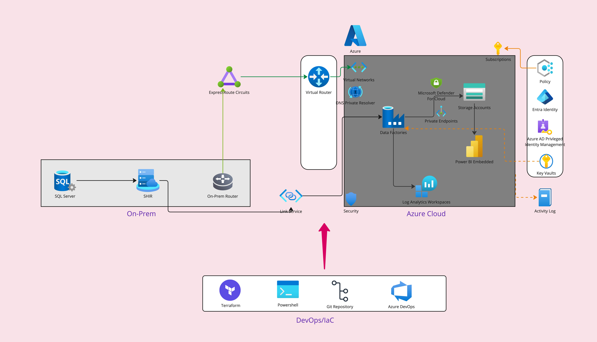

# sql-adf-blob-tf
This repo contains Infrastructure-as-Code (IaC) setup for securely migrating on-prem SQL Server data to Azure Blob Storage using Azure Data Factory (ADF) with Private Link. Ensures end-to-end private, secure, and cost-effective data transfer with Terraform automation.


### Azure Data Pipeline Deployment Guide

_**Overview**_

_This Repo provides detailed instructions on deploying a secure, automated data pipeline from On-Prem SQL Server to Azure Blob Storage and Power BI Embedded using Azure Data Factory (ADF). The architecture ensures high security, automation, and governance, integrating with Azure DevOps, Terraform, PowerShell, and Git._


<p align="center">
  
</p>

_**Architecture Components**_

**On-Prem**

- SQL Server: Source database.

- Self-Hosted Integration Runtime (SHIR): Required for secure on-premises data access.

- On-Prem Router: Connects to Azure via ExpressRoute or VPN.

**Azure Cloud**

- Azure Data Factory (ADF): Manages data movement and transformation.

- Storage Accounts: Holds extracted data before processing.

- Power BI Embedded: For visualization.

- Azure Virtual Network (VNet) & Private Endpoints: Ensures secure communication.

- Azure Log Analytics & Security: For monitoring and governance.

- Key Vault: Manages secrets and credentials.

**DevOps & Automation**

- Terraform: Infrastructure as Code (IaC) for resource provisioning.

- PowerShell: Automates configurations.

- Git Repository: Stores Terraform and script files.

- Azure DevOps: CI/CD automation.

_**Prerequisites**_

1. Tools Required

:hole: Ensure you have the following installed:

:hole: Azure CLI (az command-line tool)

:hole: Terraform (latest version)

:hole: PowerShell Core

:hole:Git CLI

2. Permissions Required

:hole: Azure Contributor role on the target subscription.

:hole: Storage Blob Data Contributor on Storage Account.

:hole: Admin access to SQL Server.

Deployment Steps

3. Clone the Repository

git clone [sql-adf-blob-tf](https://github.com/premkumar-palanichamy/sql-adf-blob-tf.git) 

cd `sql-adf-blob-tf`

4. Configure Terraform Variables

Modify variables.tf with appropriate values:

```
variable "resource_group_name" {
  description = "Azure Resource Group Name"
  type        = string
}
variable "location" {
  description = "Azure Region"
  type        = string
}
...
```

5. Initialize Terraform & Deploy

```
terraform init
terraform plan
terraform apply -auto-approve
````

6. Verify Deployment

:point_right: Check Azure Portal for created resources.

:point_right: Confirm ADF is configured.

:point_right: Validate Private Endpoints & Networking.

Note: To learn more about the steps about execution of this setup kindly refer the below link:
Execution Doc: [Onprem-to-AzureCloud-DataMigration-Analysis-Visualise-PowerBI](./docs/execution_docs.md)

# License

This project is licensed under the [MIT](https://opensource.org/license/MIT) - see the LICENSE file for details.

Please replace `https://github.com/premkumar-palanichamy/sql-adf-blob-tf` with the URL of your Git repository if you have one. This README provides a comprehensive guide to your Git Mirroring concept and can be extended or modified as needed.


## <font color = "red"> Follow-Me </font>

[](https://github.com/premkumar-palanichamy)

<p align="left">
<a href="https://linkedin.com/in/premkumarpalanichamy" target="blank"></a>
</p>

[](https://www.youtube.com/channel/UCJKEn6HeAxRNirDMBwFfi3w)
